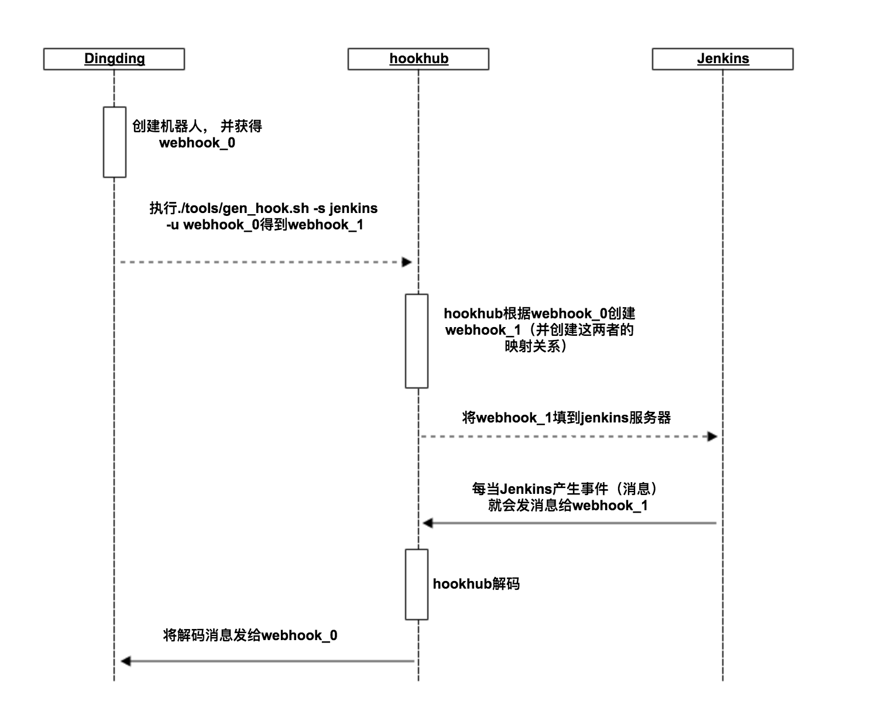

# Hookhub

一个简单的webhook消息转发服务器。

以下是使用hookhub转发jenkins消息的时序图。

配置过程如下:
* 先在钉钉群中（右上角）创建机器人，并保留钉钉生成webhook_0
* 到hookhub项目根目录下，执行`./tools/gen_hook.sh -s jenkins -u webhook_0`（注意将上一步的webhook_0替换到命令中。执行成功后会返回一个webhook_1。
* 将webhook_1填到jenkins服务器(notification plugin)。

## Get Started

* 启动hookhub服务

        docker-compose -f docker/docker-compose.yml up -d

* 使用url向hookhub换取webhook

        # ./tools/gen_hook.sh -s jenkins -u http://xxx.xxx.xxx/robot/send?access_token=xxxxx
        {
            "ok": true,
            "webhook": "http://120.78.197.57/webhook/jira?access_token=5467e9fa74ae4a9ba7adec4307ccfacb"
        }

`http://xxx.xxx.xxx/robot/send?access_token=xxxxx` 为在钉钉创建机器人时的生成的webhook。 
这条命令的功能是向使用钉钉创建的webhook_0向hookhub换取hookhub的webhook_1;将webhook_1贴到jenkins（或其他站点）上，这样就能让hookhub转发消息了。

注意：返回结果中webhook的值中不带端口号，是因为受本地nginx影响，使用时应当根据情况带上端口号3002。
HOST需要在common/config.py中配置

## Roadmap

* 日志分流: 将日志根据site分类 (done)
* 增加Oauth流程
* 支持Trello
* 支持Gitlab

## Descriptions

* 已支持

  * Jenkins
  * Jira

